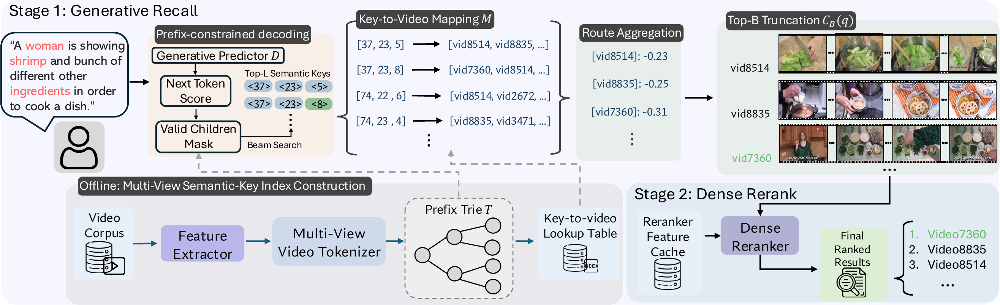
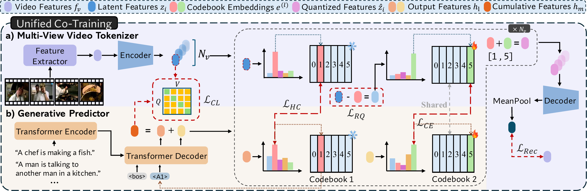

# GRDR: A learned semantic-key index for large-scale text-to-video retrieval

[](https://arxiv.org/abs/2601.21193)
[](https://huggingface.co/datasets/JasonCoderMaker/GRDR-TVR)
[](LICENSE)

Official implementation of **"GRDR: A Learned Semantic-Key Index for Large-Scale Text-to-Video Retrieval"**.

<p align="center">
  
</p>

## Overview

GRDR targets large-scale text-to-video retrieval, where the main systems bottleneck is the stage-1 candidate generator rather than the stage-2 reranker. The goal is to keep the stage-1 serving index compact, keep query latency bounded as the corpus grows, and still pass enough relevant candidates to a strong dense reranker.

- Dense stage-1 retrieval stores video embeddings and searches them at query time, so storage and search cost grow with the corpus.
- Prior generative retrieval methods usually assign one semantic key per video, which gives each video only one access path and weakens candidate coverage.
- GRDR learns multiple query-guided semantic keys per video, jointly trains the tokenizer and generative predictor over a shared codebook, and materializes a bounded candidate pool through prefix-constrained decoding and lookup.
- X-Pool reranks the candidate pool for fine-grained final ranking.

The deployed stage-1 index stores four semantic keys per video, three codes per key, and an integer video id. Under the paper's storage accounting, this is 32 bytes per video.

<p align="center">
  
</p>

## Installation

The release scripts use two conda environments by default:

- `semantictvr` for GRDR training and candidate export.
- `xpool` for X-Pool reranking.

You can override the names with `SEMANTICTVR_ENV=<env>` and `XPOOL_ENV=<env>` when running scripts.

```bash
git clone https://github.com/JasonCoderMaker/GRDR.git
cd GRDR

conda create -n semantictvr python=3.12
conda activate semantictvr
pip install torch==2.6.0 --index-url https://download.pytorch.org/whl/cu124
pip install transformers==4.47.0 accelerate==1.11.0 faiss-cpu==1.8.0 wandb==0.21.4 \
    huggingface-hub==0.36.0 einops==0.8.1 timm==1.0.19 ftfy==6.3.1 pandas tqdm
```

Set up the X-Pool environment separately:

```bash
conda create -n xpool python=3.8
conda activate xpool
pip install torch==2.0.1 torchvision==0.15.2 --index-url https://download.pytorch.org/whl/cu118
pip install transformers==4.6.1 opencv-python==4.5.3.56 pandas numpy tqdm tensorboard ftfy
```

## Data Preparation

All release features and checkpoints are hosted on Hugging Face:
[JasonCoderMaker/GRDR-TVR](https://huggingface.co/datasets/JasonCoderMaker/GRDR-TVR).

Download only the dataset you plan to use:

```bash
# MSR-VTT
python download_features.py --all --datasets msrvtt

# ActivityNet
python download_features.py --all --datasets actnet

# DiDeMo
python download_features.py --all --datasets didemo

# Panda
python download_features.py --all --datasets panda
```

Download individual components when you do not need the full bundle:

```bash
# InternVideo2 features only
python download_features.py --features --datasets msrvtt actnet

# GRDR checkpoints only
python download_features.py --grdr --datasets msrvtt

# X-Pool checkpoints and cached video features only
python download_features.py --xpool --xpool-features --datasets msrvtt
```

## Evaluation

The paper's main setting is full-corpus retrieval: the search pool is the union of training and test videos. Each script first exports GRDR candidates, then reranks the exported candidate JSON with X-Pool.

```bash
# Run one dataset first
python download_features.py --all --datasets msrvtt
bash scripts/Eval/MSRVTT/full_corpus.sh

# Full-corpus evaluation for all paper datasets
bash scripts/Eval/MSRVTT/full_corpus.sh
bash scripts/Eval/ACTNET/full_corpus.sh
bash scripts/Eval/DiDeMo/full_corpus.sh
bash scripts/Eval/Panda/full_corpus.sh
```

Inductive scripts are supplemental and use the same released checkpoints:

```bash
bash scripts/Eval/MSRVTT/Inductive.sh
bash scripts/Eval/ACTNET/Inductive.sh
bash scripts/Eval/DiDeMo/Inductive.sh
bash scripts/Eval/Panda/Inductive.sh
```

### Stage 1: Generative Recall

This example exports MSR-VTT full-corpus candidates with the released GRDR checkpoint:

```bash
CUDA_VISIBLE_DEVICES=0 conda run -n semantictvr python run.py \
    --candidate_export \
    --eval_checkpoint output/checkpoints/GRDR/msrvtt/best_model/best_model.pt \
    --model_name t5-small \
    --dataset msrvtt \
    --setting 2 \
    --code_num 128 \
    --max_length 3 \
    --batch_size 40 \
    --eval_batch_size 40 \
    --num_latent_tokens 4 \
    --num_candidates 100 \
    --candidate_handoff_cap 300 \
    --inference_reorder_by_access_score \
    --access_score_bucket_gamma 0.50 \
    --output_json candidates/GRDR/msrvtt/msrvtt_t2_100_candidates.json \
    --seed 42 \
    --device 0 \
    --use_pseudo_queries
```

For Panda, use `--code_num 4096`, `--num_candidates 200`, and `--candidate_handoff_cap 600`.

### Stage 2: Dense Reranking (X-Pool)

Rerank the exact candidate file exported by stage 1:

```bash
CUDA_VISIBLE_DEVICES=0 PYTHONPATH="$PWD/reranker/xpool" \
conda run -n xpool python reranker/xpool/test.py \
    --dataset_name MSRVTT \
    --videos_dir dataset/msrvtt_data/MSRVTT_Videos \
    --msrvtt_train_file 9k \
    --eval_checkpoint reranker/xpool/ckpt/msrvtt9k_model_best.pth \
    --candidate_file candidates/GRDR/msrvtt/msrvtt_t2_100_candidates.json \
    --rerank_mode \
    --expanded_pool \
    --use_cached_video_features \
    --video_cache_dir reranker/xpool/video_features_cache/Xpool \
    --batch_size 32 \
    --pool_batch_size 64 \
    --result_file reproduction/GRDR/msrvtt/full_corpus/result.csv \
    --huggingface \
    --seed 42 \
    --no_tensorboard
```

### Pre-extract Video Features

The release bundle includes cached X-Pool video features. If you need to rebuild a cache from videos, use the X-Pool extractor:

```bash
python reranker/xpool/utils/extract_video_features.py \
    --dataset_name MSRVTT \
    --videos_dir dataset/msrvtt_data/MSRVTT_Videos \
    --checkpoint reranker/xpool/ckpt/msrvtt9k_model_best.pth \
    --cache_dir reranker/xpool/video_features_cache/Xpool \
    --split train

python reranker/xpool/utils/extract_video_features.py \
    --dataset_name MSRVTT \
    --videos_dir dataset/msrvtt_data/MSRVTT_Videos \
    --checkpoint reranker/xpool/ckpt/msrvtt9k_model_best.pth \
    --cache_dir reranker/xpool/video_features_cache/Xpool \
    --split test
```

### Inference Latency Testing

Measure per-query latency for the two-stage GRDR pipeline with the X-Pool utility:

```bash
CUDA_VISIBLE_DEVICES=0 python reranker/xpool/test_perquery.py \
    --dataset_name MSRVTT \
    --videos_dir dataset/msrvtt_data/MSRVTT_Videos \
    --checkpoint reranker/xpool/ckpt/msrvtt9k_model_best.pth \
    --candidate_file candidates/GRDR/msrvtt/msrvtt_t2_100_candidates.json \
    --cache_dir reranker/xpool/video_features_cache/Xpool/MSRVTT \
    --expanded_pool \
    --huggingface \
    --seed 42
```

The paper reports batch-1 online latency on one NVIDIA A6000 GPU. The first 50 queries are warm-up, and the reported latency averages at least 200 later queries.

## Training

The training scripts pin the released recipe for each dataset:

```bash
bash scripts/Train/MSRVTT.sh
bash scripts/Train/ACTNET.sh
bash scripts/Train/DiDeMo.sh
bash scripts/Train/Panda.sh
```

They set the model, codebook size, code length, number of semantic views, loss weights, phase epochs, seed, and output path. Training writes checkpoints under `output/checkpoints/GRDR/<dataset>/`. W&B runs default to offline mode.

## Results

### Full-corpus setting

The search pool contains both training and test videos. These are the GRDR rows from paper Table 1.

| Dataset | R@1 | R@5 | R@10 | Latency (ms) | Search pool |
|---------|-----|-----|------|--------------|-------------|
| MSR-VTT | 19.2 | 35.9 | 44.8 | 223 | 10,000 |
| ActivityNet | 21.6 | 44.0 | 55.1 | 214 | 14,926 |
| DiDeMo | 19.7 | 35.6 | 42.9 | 217 | 9,384 |
| Panda | 10.2 | 19.8 | 24.9 | 473 | 2,156,234 |

### Inductive setting

The search pool is restricted to unseen test videos. These values come from the release verification CSVs and are supplemental to the paper's full-corpus table.

| Dataset | R@1 | R@5 | R@10 |
|---------|-----|-----|------|
| MSR-VTT | 45.7 | 69.8 | 78.8 |
| ActivityNet | 33.7 | 63.3 | 76.3 |
| DiDeMo | 39.7 | 66.3 | 74.6 |
| Panda | 60.9 | 85.9 | 90.9 |

## Project Structure

```text
GRDR/
├── run.py                        # Main training and candidate-export entry
├── download_features.py          # Hugging Face release downloader
├── models/                       # GRDR model and video tokenizer code
├── trainer/                      # Training and candidate-generation logic
├── reranker/xpool/               # X-Pool reranker integration
├── data/                         # Dataset loaders and annotations
├── assets/                       # README and paper figures
├── scripts/
│   ├── Train/                    # One training script per paper dataset
│   └── Eval/                     # Inductive and full-corpus eval per dataset
```

## Citation

```bibtex
@article{zhao2026grdr,
  title={GRDR: A Learned Semantic-Key Index for Large-Scale Text-to-Video Retrieval},
  author={Zhao, Zecheng and Chen, Zhi and Huang, Zi and Sadiq, Shazia and Chen, Tong},
  journal={Proceedings of the VLDB Endowment},
  volume={20},
  number={1},
  year={2026}
}
```

## Acknowledgments

We thank the authors of [InternVideo2](https://github.com/OpenGVLab/InternVideo), [X-Pool](https://github.com/layer6ai-labs/xpool), and [T5](https://github.com/google-research/text-to-text-transfer-transformer) for their excellent work.

## License

This project is licensed under the MIT License.
