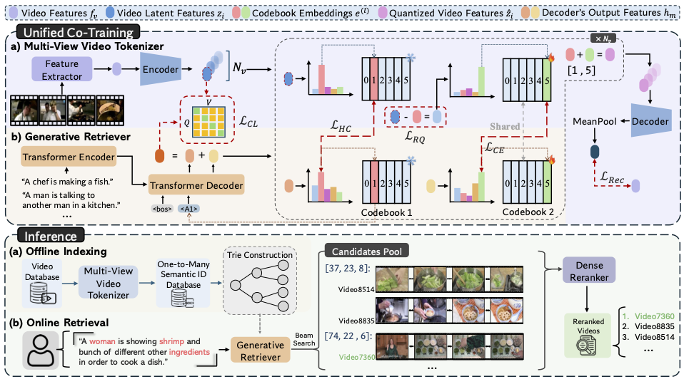

# GRDR: A Semantic-ID Index and Recall-Rerank Query Engine for Scalable Text-to-Video Retrieval

[](https://arxiv.org/abs/2601.21193)
[](https://huggingface.co/datasets/JasonCoderMaker/GRDR-TVR)
[](LICENSE)

<p align="center">
  
</p>

Official implementation of **"GRDR: A Semantic-ID Index and Recall-Rerank Query Engine for Scalable Text-to-Video Retrieval"**.

## Overview

GRDR targets repository-scale text-to-video retrieval, where the main systems bottleneck is the stage-1 candidate generator rather than the stage-2 reranker. The project goal is to build a stage-1 index that keeps storage and query-time cost tractable while preserving enough recall for a strong dense matcher downstream.

- **Why dense stage 1 is not enough**: cached video embeddings and exhaustive query-time scoring both grow with corpus size.
- **Why prior generative retrieval is not enough**: a single semantic ID per video under-covers polysemous content, and video-only key assignment makes text queries harder to decode into the right IDs.
- **What GRDR does**: learns a multi-view semantic-ID index with shared-vocabulary co-training, uses prefix-constrained decoding over valid trie paths to recall a compact candidate set, then applies X-Pool reranking for fine-grained matching.
- **Practical target**: competitive quality with much lower storage and latency than dense stage-1 retrieval, especially under full-corpus serving.

## Installation

```bash
git clone https://github.com/JasonCoderMaker/GRDR.git
cd GRDR
conda create -n grdr python=3.12
conda activate grdr
pip install torch==2.6.0 --index-url https://download.pytorch.org/whl/cu124
pip install transformers==4.47.0 accelerate==1.11.0 faiss-cpu==1.8.0 wandb==0.21.4 \
    huggingface-hub==0.36.0 einops==0.8.1 timm==1.0.19 ftfy==6.3.1
```

## Data Preparation

All features and checkpoints are hosted on HuggingFace: [JasonCoderMaker/GRDR-TVR](https://huggingface.co/datasets/JasonCoderMaker/GRDR-TVR)

> **Note:** You only need to download the dataset(s) you plan to use. There is no need to download all four datasets.

**Download all components for a specific dataset:**
```bash
# MSR-VTT
python download_features.py --all --datasets msrvtt

# ActivityNet
python download_features.py --all --datasets actnet

# DiDeMo
python download_features.py --all --datasets didemo

# LSMDC
python download_features.py --all --datasets lsmdc
```

**Download specific components:**
```bash
# Only InternVideo2 features
python download_features.py --features --datasets msrvtt actnet

# Only GRDR checkpoints
python download_features.py --grdr --datasets msrvtt

# Only Xpool checkpoints and features
python download_features.py --xpool --xpool-features --datasets msrvtt
```

## Evaluation

### Stage 1: Generative Recall

```bash
python run.py --eval --dataset msrvtt \
    --eval_checkpoint output/checkpoints/GRDR/msrvtt/best_model/best_model.pt \
    --code_num 128 --max_length 3 --num_candidates 100 --setting 1
```

### Stage 2: Dense Reranking (X-Pool)

First, set up the X-Pool environment: https://github.com/layer6ai-labs/xpool

```bash
python reranker/xpool/test.py --dataset_name MSRVTT --rerank_mode \
    --eval_checkpoint reranker/xpool/ckpt/msrvtt9k_model_best.pth \
    --candidate_file candidates/msrvtt_c128l3_100_candidates_t1.json
```

For full evaluation commands across all datasets, see the evaluation scripts:
- **Inductive setting**: [`scripts/eval_t1.sh`](scripts/eval_t1.sh) (--setting 1)
- **Full-corpus setting**: [`scripts/eval_t2.sh`](scripts/eval_t2.sh) (--setting 2)

### Pre-extract Video Features

Before running latency benchmarks or full-corpus evaluation, pre-extract CLIP video features:

```bash
# MSR-VTT (extract both train and test splits for full-corpus evaluation)
python reranker/xpool/utils/extract_video_features.py \
    --dataset_name MSRVTT \
    --videos_dir dataset/msrvtt_data/MSRVTT_Videos \
    --checkpoint reranker/xpool/ckpt/msrvtt9k_model_best.pth \
    --cache_dir reranker/xpool/video_features_cache/Xpool \
    --split train

python reranker/xpool/utils/extract_video_features.py \
    --dataset_name MSRVTT \
    --videos_dir dataset/msrvtt_data/MSRVTT_Videos \
    --checkpoint reranker/xpool/ckpt/msrvtt9k_model_best.pth \
    --cache_dir reranker/xpool/video_features_cache/Xpool \
    --split test
```

### Inference Latency Testing

Measure per-query latency for the two-stage GRDR pipeline. For detailed commands across all datasets, see the scripts under [`reranker/xpool/scripts/`](reranker/xpool/scripts/).

```bash
# MSR-VTT (with GRDR candidate reranking)
CUDA_VISIBLE_DEVICES=0 python reranker/xpool/test_perquery.py \
    --dataset_name MSRVTT \
    --videos_dir dataset/msrvtt_data/MSRVTT_Videos \
    --checkpoint reranker/xpool/ckpt/msrvtt9k_model_best.pth \
    --candidate_file candidates/msrvtt_c128l3_100_candidates_t2.json \
    --cache_dir reranker/xpool/video_features_cache/Xpool/MSRVTT \
    --expanded_pool --huggingface --seed 42
```

## Training

```bash
python run.py --dataset msrvtt --model_name t5-small --code_num 128 --max_length 3 \
    --batch_size 512 --num_latent_tokens 4 --exp_name msrvtt_train
```

See `scripts/train.sh` for full training configurations.

## Research Workflow

Research outputs are now governed by a fixed package layout instead of ad hoc top-level folders.

- Create a new research package with `bash scripts/dev/new_research.sh <slug>`
- Write all in-repo research docs under `research/active/<YYYY-MM-DD>-<slug>/`
- Move finished or paused work to `research/archive/<YYYY-MM-DD>-<slug>/`
- Write runtime state, supervisor JSON, local logs, and scratch CSVs under `var/research/<YYYY-MM-DD>-<slug>/`

The canonical policy and package templates live under [`research/`](research/).

## Results

### Inductive Setting
The search pool is restricted to unseen videos from the test set.

| Dataset | R@1 | R@5 | R@10 | Latency (ms) |
|---------|-----|-----|------|--------------|
| MSR-VTT | 46.0 | 70.1 | 78.0 | 136 |
| ActivityNet | 33.7 | 63.7 | 76.6 | 125 |
| DiDeMo | 39.9 | 65.8 | 74.2 | 118 |
| LSMDC | 23.5 | 39.4 | 46.2 | 144 |

### Full-Corpus Setting
The search pool contains both training and test videos, reflecting real-world deployment scenarios.

| Dataset | R@1 | R@5 | R@10 | Latency (ms) |
|---------|-----|-----|------|--------------|
| MSR-VTT | 19.2 | 35.9 | 44.8 | 278 |
| ActivityNet | 19.2 | 41.1 | 51.8 | 116 |
| DiDeMo | 15.5 | 29.7 | 36.1 | 119 |
| LSMDC | 2.1 | 4.8 | 5.9 | 121 |

## Project Structure

```
GRDR/
├── run.py                        # Main training/evaluation entry
├── download_features.py          # HuggingFace downloader
├── models/                       # Core GRDR model and tokenizer code
├── trainer/                      # Training and evaluation logic
├── reranker/xpool/               # Dense reranking module
├── data/                         # Dataset annotations
├── research/
│   ├── active/                   # Ongoing research packages
│   ├── archive/                  # Archived research packages
│   ├── templates/                # Standard package skeleton
│   └── README.md                 # Research layout contract
├── scripts/
│   ├── train.sh                  # Stable training entry
│   ├── eval_t1.sh                # Stable inductive evaluation entry
│   ├── eval_t2.sh                # Stable full-corpus evaluation entry
│   ├── dev/new_research.sh       # Research package scaffold
│   └── ops/                      # Bunya and Panda-70M ops scripts
└── var/                          # Gitignored local research state
```

## Citation

```bibtex
@inproceedings{grdr2026,
  title={Generative Recall, Dense Reranking: Learning Multi-View Semantic IDs
         for Efficient Text-to-Video Retrieval},
  author={Zhao, Zecheng and Chen, Zhi and Huang, Zi and Sadiq, Shazia and Chen, Tong},
  year={2026}
}
```

## Acknowledgments

We thank the authors of [InternVideo2](https://github.com/OpenGVLab/InternVideo), [X-Pool](https://github.com/layer6ai-labs/xpool), and [T5](https://github.com/google-research/text-to-text-transfer-transformer) for their excellent work.

## License

This project is licensed under the MIT License.
